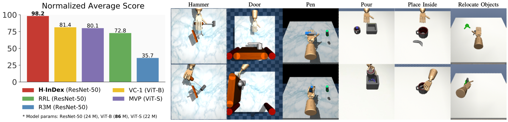

# H-InDex: Visual Reinforcement Learning with Hand-Informed Representations for Dexterous Manipulation
Official PyTorch Implementation of **H-InDex** from [H-InDex: Visual Reinforcement Learning with Hand-Informed Representations for Dexterous Manipulation](https://yanjieze.com/H-InDex/) by 

[Yanjie Ze](https://yanjieze.com/), [Yuyao Liu](https://yuyaoliu.me/)\*, [Ruizhe Shi](https://srzer.github.io/)\*, [Jiaxin Qin](https://github.com/JiaxinQin0814),
[Zhecheng Yuan](https://openreview.net/profile?id=~Zhecheng_Yuan1), [Jiashun Wang](https://jiashunwang.github.io/), [Xiaolong Wang](https://xiaolonw.github.io/), [Huazhe Xu](http://hxu.rocks/)

    

H-InDex is a visual reinforcement learning framework that leverages hand-informed representations to learn dexterous manipulation skills with great efficiency.

# Installation
See [INSTALL.md](INSTALL.md).

# Usage 
given a task name, you could run the following pipeline.
- Stage 1: Human Hand Pretraining. Simply download the pre-trained hand representation from [FrankMocap](https://github.com/facebookresearch/frankmocap) by this command `wget https://dl.fbaipublicfiles.com/eft/fairmocap_data/hand_module/checkpoints_best/pose_shape_best.pth -O archive/frankmocap_hand.pth --no-check-certificate`
- Stage 2: Offline Adaptation.
    1. generate image dataset for offline adaptation, with `scripts/adroit/gen_img_dataset.sh` or `scripts/dexmv/gen_img_dataset.sh`
    2. adapt affine transformation in pretrained model, with `scripts/train_ttp.sh`
    - finished statge 2 checkpoints: place_inside, pour, relocate-mug, relocate-foam_brick,
- Stage 3: Online Adaptation. Train RL agents, with `scripts/adroit/train.sh` or `scripts/dexmv/train.sh`

# Tasks
We provide 12 dexterous manipulation Tasks in total:
- Adroit (3): pen, door, hammer
- DexMV (9): pour, place_inside, relocate-mug, relocate-foam_brick, relocate-large_clamp, relocate-mustard_bottle, relocate-potted_meat_can, relocate-sugar_box, relocate-tomato_soup_can

# Pre-Trained Models
- Our human hand-informed representation (from FrankMocap): `wget https://dl.fbaipublicfiles.com/eft/fairmocap_data/hand_module/checkpoints_best/pose_shape_best.pth -O archive/frankmocap_hand.pth --no-check-certificate`

# Codebases
Our work is based on many open-source projects. The algorithms are mainly built upon [RRL](https://github.com/facebookresearch/RRL) and [TTP](https://github.com/harry11162/TTP). The simulation environments are from [DAPG](https://github.com/aravindr93/hand_dapg) and [DexMV](https://github.com/yzqin/dexmv-sim). The pre-trained hand representation is from [FrankMocap](https://github.com/facebookresearch/frankmocap). Baselines are from [RRL](https://github.com/facebookresearch/RRL), [MVP](https://github.com/ir413/mvp), [R3M](https://github.com/facebookresearch/r3m) and [VC-1](https://github.com/facebookresearch/eai-vc). We thank all these open-source projects for their contributions to the community.

# License
H-InDex is licensed under the MIT license. RRL is licensed under the Apache V2 license.

